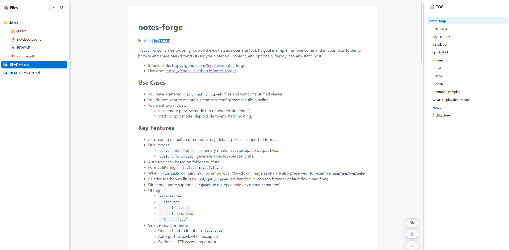
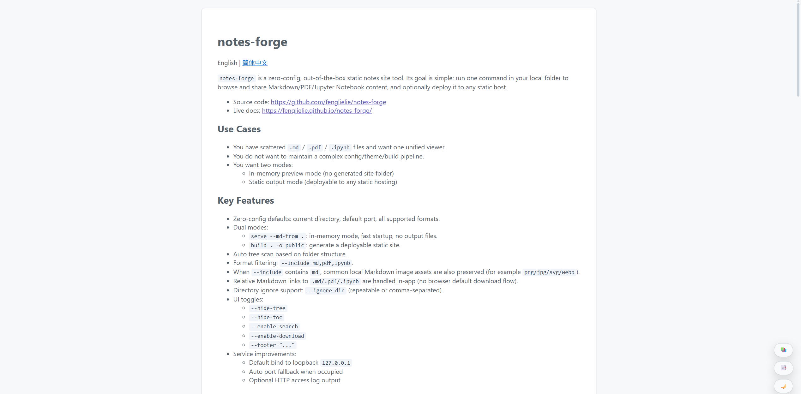
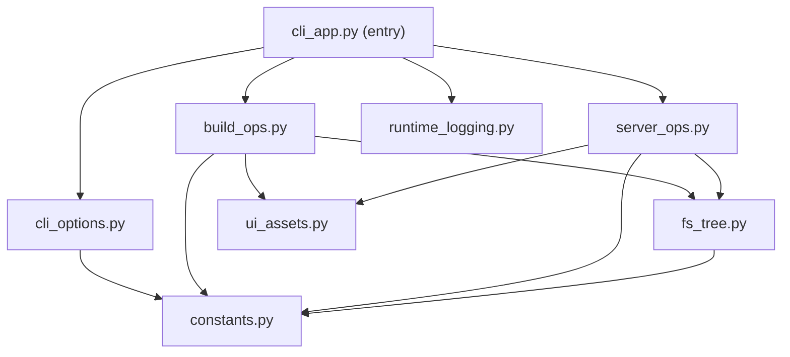

# notes-forge

English | [简体中文](./README.zh-CN.md)

`notes-forge` is a zero-configuration tool for browsing and publishing notes as a static site.
It gives Markdown, PDF, and Jupyter Notebook files a single interface, and supports both local preview and static deployment.
Unlike many documentation-oriented tools, it does not require a config file, a theme setup step, or front matter in Markdown files.

- Source code: https://github.com/fenglielie/notes-forge
- Live docs: https://fenglielie.github.io/notes-forge/





## Why notes-forge

- No config file.
- No Markdown front matter.
- No project-specific content structure.
- No separate docs-site setup before preview or deployment.

## Use Cases

- View `.md`, `.pdf`, and `.ipynb` files in one place.
- Keep existing Markdown files as they are, without adding front matter or project-specific metadata.
- Skip the overhead of a custom site generator, theme system, or build pipeline.
- Use the same content tree for both local preview and static deployment.

## Key Features

- Zero-configuration defaults: current directory, default port, and all supported formats.
- Two operating modes:
  - `serve --md-from .`: in-memory preview without generating an output directory.
  - `build . -o public`: static output suitable for deployment.
- Automatic tree generation based on the source directory structure.
- Format selection via `--include md,pdf,ipynb`.
- Preserve common Markdown image assets automatically when `md` is included.
- In-app handling for relative links to `.md`, `.pdf`, and `.ipynb` files.
- Directory exclusion via `--ignore-dir` (repeatable or comma-separated).
- Frontend options:
  - `--hide-tree`
  - `--hide-toc`
  - `--enable-search`
  - `--enable-download`
  - `--enable-theme`
  - `--footer "..."`
- Local-first serving defaults:
  - Default bind address `127.0.0.1`
  - Automatic port fallback when the requested port is unavailable
  - Optional HTTP access logging

## Installation

The command name is `notes-forge`. Install it with `uv`:

```bash
uv tool install git+https://github.com/fenglielie/notes-forge.git@main
```

Or install it into the current Python environment:

```bash
pip install git+https://github.com/fenglielie/notes-forge.git@main
```

Check installation:

```bash
notes-forge --version
```

## Quick Start

In your notes directory:

```bash
# 1) Preview directly (in-memory mode, no public output)
notes-forge serve --md-from .

# 2) Build static site output
notes-forge build . -o public

# 3) Preview built static site
notes-forge serve --html-from public -p 8080
```

## Commands

### build

Generate static output for deployment. Source files are not pre-rendered into separate HTML pages.

```bash
notes-forge build [input_dir] -o [output_dir]
```

Common options:

- `--include md,pdf,ipynb`
- `--copy-all-files` (explicitly copy all non-hidden files; default is include-selected content + Markdown image assets)
- `--ignore-dir node_modules,.git,build`
- `--hide-tree`
- `--hide-toc`
- `--enable-search`
- `--enable-download`
- `--enable-theme`
- `--footer "your footer text"`

### serve

Choose one of the following modes:

- `--md-from <dir>`: serve the source directory directly
- `--html-from <dir>`: serve prebuilt static output directory
- If neither is provided, `serve` defaults to `--md-from .`

```bash
notes-forge serve --md-from . --port 8080
notes-forge serve --html-from public --port 8080
```

Common options:

- `--host 127.0.0.1`
- `-p, --port 8080`
- `--no-browser`
- `--http-log-file logs/http-access.log`

Notes:

- UI-related options such as `--hide-tree`, `--hide-toc`, `--enable-search`, `--enable-download`, `--enable-theme`, and `--footer` apply when serving from source or when building static output.
- In `serve --html-from <dir>` mode, those UI options are ignored because the frontend has already been built.

### clean

Remove generated output directory:

```bash
notes-forge clean -o public
```

## Common Examples

```bash
# Show Markdown only
notes-forge serve --md-from . --include md

# Build and explicitly copy all non-hidden files (legacy-compatible behavior)
notes-forge build . -o public --copy-all-files

# Ignore multiple directories
notes-forge build . -o public --ignore-dir .git --ignore-dir node_modules,dist

# Enable search, download, and theme buttons
notes-forge serve --md-from . --enable-search --enable-download --enable-theme

# Add fixed footer
notes-forge serve --md-from . --footer "© Your Name"
```

## Deployment

- `notes-forge build` does not turn each `.md`, `.pdf`, or `.ipynb` file into its own HTML page.
- The generated `public` directory contains:
  - A single frontend entry point: `index.html`
  - A content index: `tree.json`
  - Source content files copied from the input directory
    - By default: selected content types (`md`, `pdf`, `ipynb`) and local Markdown image assets
    - Optionally: all non-hidden files when `--copy-all-files` is enabled
- Rendering happens in the browser. The frontend loads raw source files through `tree.json` and renders them on demand.
- Deployment simply means publishing the generated `public` directory to any static host.
- This repository's own documentation is published that way:
  - Source repository: https://github.com/fenglielie/notes-forge
  - Live site: https://fenglielie.github.io/notes-forge/

## Notes

- `--enable-search` and `--hide-tree` cannot be used together.
- The default host is `127.0.0.1`. For LAN access, specify `--host 0.0.0.0` explicitly.
- In `serve --md-from` mode, server-side file access is limited to supported content types. When `md` is included, common local Markdown image assets are allowed as well.
- Relative links to `.md`, `.pdf`, and `.ipynb` files are intercepted and opened inside the app. External links (`http`, `https`, `mailto`) keep the browser default behavior.

## Architecture

Internal module layout:

- `notes_forge/cli_app.py`: command parsing and top-level command orchestration.
- `notes_forge/cli_options.py`: reusable argparse option builders and include normalization.
- `notes_forge/build_ops.py`: `build` and `clean` operations, file copy policy, safe cleanup.
- `notes_forge/server_ops.py`: in-memory/static HTTP serving, handler security checks, port fallback.
- `notes_forge/fs_tree.py`: tree scan, ignore resolution, path inclusion/exclusion helpers.
- `notes_forge/ui_assets.py`: bundled asset loading and `index.html` rendering.
- `notes_forge/runtime_logging.py`: user-facing logs and optional HTTP access logger.
- `notes_forge/constants.py`: shared constants/defaults.


