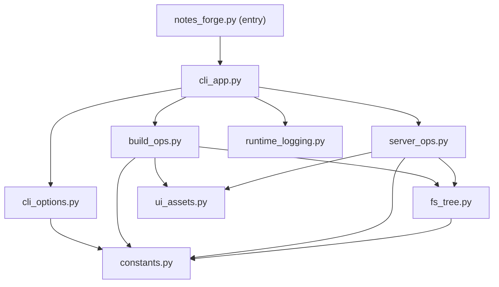

# notes-forge

English | [简体中文](./README.zh-CN.md)

`notes-forge` is a zero-config, out-of-the-box static notes site tool.
Its goal is simple: run one command in your local folder to browse and share Markdown/PDF/Jupyter Notebook content, and optionally deploy it to any static host.

## Use Cases

- You have scattered `.md` / `.pdf` / `.ipynb` files and want one unified viewer.
- You do not want to maintain a complex config/theme/build pipeline.
- You want two modes:
  - In-memory preview mode (no generated site folder)
  - Static output mode (deployable to any static hosting)

## Key Features

- Zero-config defaults: current directory, default port, all supported formats.
- Dual modes:
  - `serve --md-from .`: in-memory mode, fast startup, no output files.
  - `build . -o public`: generate a deployable static site.
- Auto tree scan based on folder structure.
- Format filtering: `--include md,pdf,ipynb`.
- When `--include` contains `md`, common local Markdown image assets are also preserved (for example `png/jpg/svg/webp`).
- Relative Markdown links to `.md/.pdf/.ipynb` are handled in-app (no browser default download flow).
- Directory ignore support: `--ignore-dir` (repeatable or comma-separated).
- UI toggles:
  - `--hide-tree`
  - `--hide-toc`
  - `--enable-search`
  - `--enable-download`
  - `--footer "..."`
- Service improvements:
  - Default bind to loopback `127.0.0.1`
  - Auto port fallback when occupied
  - Optional HTTP access log output

## Installation

The command name is `notes-forge`. Install with `uv`:

```bash
uv tool install git+https://github.com/fenglielie/notes-forge.git@main
```

Or install into the current Python environment:

```bash
pip install git+https://github.com/fenglielie/notes-forge.git@main
```

Check installation:

```bash
notes-forge --version
```

## Quick Start

In your notes directory:

```bash
# 1) Preview directly (in-memory mode, no public output)
notes-forge serve --md-from .

# 2) Build static site output
notes-forge build . -o public

# 3) Preview built static site
notes-forge serve --html-from public -p 8080
```

## Commands

### build

Generate a deployable output (not pre-rendered per-file HTML pages).

```bash
notes-forge build [input_dir] -o [output_dir]
```

Common options:

- `--include md,pdf,ipynb`
- `--copy-all-files` (explicitly copy all non-hidden files; default is include-selected content + Markdown image assets)
- `--ignore-dir node_modules,.git,build`
- `--hide-tree`
- `--hide-toc`
- `--enable-search`
- `--enable-download`
- `--footer "your footer text"`

### serve

Choose one mode:

- `--md-from <dir>`: serve source directory directly (recommended for daily usage)
- `--html-from <dir>`: serve prebuilt static output directory

```bash
notes-forge serve --md-from . --port 8080
notes-forge serve --html-from public --port 8080
```

Common options:

- `--host 127.0.0.1`
- `-p, --port 8080`
- `--no-browser`
- `--http-log-file logs/http-access.log`

### clean

Remove generated output directory:

```bash
notes-forge clean -o public
```

## Common Examples

```bash
# Show Markdown only
notes-forge serve --md-from . --include md

# Build and explicitly copy all non-hidden files (legacy-compatible behavior)
notes-forge build . -o public --copy-all-files

# Ignore multiple directories
notes-forge build . -o public --ignore-dir .git --ignore-dir node_modules,dist

# Enable search and download button
notes-forge serve --md-from . --enable-search --enable-download

# Add fixed footer
notes-forge serve --md-from . --footer "© 2026 Your Name"
```

## What "Deployable" Means

- `notes-forge build` does not pre-convert each `.md/.pdf/.ipynb` into independent HTML pages.
- `public` is essentially:
  - Single frontend entry `index.html`
  - Content index `tree.json`
  - Copied source content files:
    - Default: include-selected content types (`md/pdf/ipynb`) and local Markdown image assets
    - Optional: all non-hidden files with `--copy-all-files`
- Rendering happens in the browser: frontend loads raw files by `tree.json` and renders them.
- Deployment is simple: upload the whole `public` directory to any static file host.

## Notes

- `--enable-search` and `--hide-tree` cannot be used together.
- Default host is `127.0.0.1`; for LAN access, set `--host 0.0.0.0` explicitly.
- In `serve --md-from` mode, server-side access is restricted to allowed content types. When `--include` contains `md`, common local Markdown image assets are also allowed.
- Relative document links (`.md/.pdf/.ipynb`) in Markdown are intercepted and loaded in-app. External links (`http/https/mailto`) keep default browser behavior.

## Architecture

Module split (internal):

- `notes_forge/notes_forge.py`: stable public entry/facade and CLI entrypoint target.
- `notes_forge/cli_app.py`: command parsing and top-level command orchestration.
- `notes_forge/cli_options.py`: reusable argparse option builders and include normalization.
- `notes_forge/build_ops.py`: `build` and `clean` operations, file copy policy, safe cleanup.
- `notes_forge/server_ops.py`: in-memory/static HTTP serving, handler security checks, port fallback.
- `notes_forge/fs_tree.py`: tree scan, ignore resolution, path inclusion/exclusion helpers.
- `notes_forge/ui_assets.py`: bundled asset loading and `index.html` rendering.
- `notes_forge/runtime_logging.py`: user-facing logs and optional HTTP access logger.
- `notes_forge/constants.py`: shared constants/defaults.


