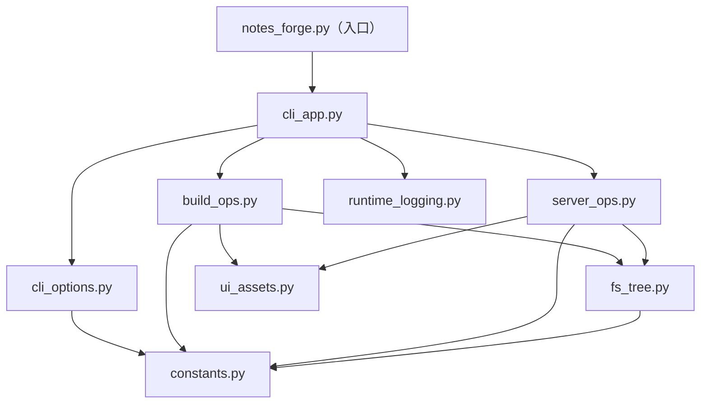

# notes-forge

[English](./README.md) | 简体中文

`notes-forge` 是一个面向笔记目录的零配置静态站点工具。
它把 Markdown、PDF 和 Jupyter Notebook 放到同一个界面里，同时支持本地预览和静态部署。
和很多偏文档站点的工具不同，它不要求额外配置文件、不要求单独的主题配置，也不要求在 Markdown 头部添加 front matter 或其他元数据。

- 源码仓库：https://github.com/fenglielie/notes-forge
- 在线文档：https://fenglielie.github.io/notes-forge/


## 为什么是 notes-forge

- 不需要额外配置文件。
- 不需要给 Markdown 补 front matter。
- 不要求为了工具重组目录结构。
- 不需要先搭一套文档站点工程再预览或部署。

## 适用场景

- 希望把 `.md`、`.pdf` 和 `.ipynb` 文件放在同一个界面里浏览。
- 希望直接使用现有 Markdown 文件，而不是为某个工具补写 front matter 或项目专用元数据。
- 不想维护额外的站点生成器、主题系统或构建流程。
- 希望同一套内容既能本地预览，也能直接部署为静态站点。

## 核心特性

- 零配置默认可用：默认当前目录、默认端口、默认启用全部支持格式。
- 双模式支持：
  - `serve --md-from .`：内存预览模式，不生成输出目录。
  - `build . -o public`：生成可部署的静态输出。
- 按目录结构自动生成内容树。
- 支持通过 `--include md,pdf,ipynb` 选择内容格式。
- 当包含 `md` 时，自动保留常见 Markdown 本地图片资源。
- Markdown 中指向 `.md`、`.pdf`、`.ipynb` 的相对链接会在应用内处理。
- 支持通过 `--ignore-dir` 排除目录（可重复或逗号分隔）。
- 前端界面开关：
  - `--hide-tree`
  - `--hide-toc`
  - `--enable-search`
  - `--enable-download`
  - `--footer "..."`
- 面向本地使用的默认服务行为：
  - 默认绑定地址为 `127.0.0.1`
  - 端口被占用时自动回退
  - 可选 HTTP 访问日志输出

## 安装

命令名为 `notes-forge`，可以通过 `uv` 安装：

```bash
uv tool install git+https://github.com/fenglielie/notes-forge.git@main
```

或安装到当前 Python 环境：

```bash
pip install git+https://github.com/fenglielie/notes-forge.git@main
```

安装后执行：

```bash
notes-forge --version
```

## 快速开始

在你的笔记目录中：

```bash
# 1) 直接预览（内存模式，不生成 public）
notes-forge serve --md-from .

# 2) 构建静态站点
notes-forge build . -o public

# 3) 预览已构建站点
notes-forge serve --html-from public -p 8080
```

## 命令说明

### build

生成可部署的静态输出。源文件不会被预先转换成独立 HTML 页面。

```bash
notes-forge build [input_dir] -o [output_dir]
```

常用参数：

- `--include md,pdf,ipynb`
- `--copy-all-files`（显式复制全部非隐藏文件；默认仅复制 `--include` 相关内容与 Markdown 图片资源）
- `--ignore-dir node_modules,.git,build`
- `--hide-tree`
- `--hide-toc`
- `--enable-search`
- `--enable-download`
- `--footer "你的页脚文案"`

### serve

支持以下两种服务模式：

- `--md-from <dir>`：直接服务源目录
- `--html-from <dir>`：服务已构建静态目录

```bash
notes-forge serve --md-from . --port 8080
notes-forge serve --html-from public --port 8080
```

常用参数：

- `--host 127.0.0.1`
- `-p, --port 8080`
- `--no-browser`
- `--http-log-file logs/http-access.log`

### clean

清理构建输出目录：

```bash
notes-forge clean -o public
```

## 常见示例

```bash
# 仅展示 Markdown
notes-forge serve --md-from . --include md

# 构建时显式复制所有非隐藏文件（兼容旧行为）
notes-forge build . -o public --copy-all-files

# 忽略多个目录
notes-forge build . -o public --ignore-dir .git --ignore-dir node_modules,dist

# 启用搜索和下载按钮
notes-forge serve --md-from . --enable-search --enable-download

# 添加固定页脚
notes-forge serve --md-from . --footer "© 2026 Your Name"
```

## 部署

- `notes-forge build` 不会把每个 `.md`、`.pdf` 或 `.ipynb` 单独转换成 HTML 页面。
- 生成的 `public` 目录包含：
  - 统一前端入口：`index.html`
  - 内容索引：`tree.json`
  - 从输入目录复制得到的原始内容文件
    - 默认：按 `--include` 选择的内容类型，以及 Markdown 本地图片资源
    - 可选：启用 `--copy-all-files` 后复制全部非隐藏文件
- 页面渲染发生在浏览器端。前端通过 `tree.json` 加载原始文件并按需渲染。
- 因此，部署时只需要把生成后的 `public` 目录发布到任意静态托管服务。
- 这个仓库的文档站点本身就是按这种方式发布的：
  - 源码仓库：https://github.com/fenglielie/notes-forge
  - 在线页面：https://fenglielie.github.io/notes-forge/

## 注意事项

- `--enable-search` 与 `--hide-tree` 不能同时使用。
- 默认主机地址为 `127.0.0.1`。如需局域网访问，请显式指定 `--host 0.0.0.0`。
- 在 `serve --md-from` 模式下，服务端仅允许访问受支持的内容类型；当包含 `md` 时，也允许访问常见 Markdown 本地图片资源。
- Markdown 中指向 `.md`、`.pdf`、`.ipynb` 的相对链接会由前端拦截并在应用内打开；外部链接（`http`、`https`、`mailto`）仍然保持浏览器默认行为。

## 模块划分

内部模块结构如下：

- `notes_forge/notes_forge.py`：稳定的公开入口/兼容门面，以及 CLI 入口目标。
- `notes_forge/cli_app.py`：命令解析与顶层命令调度。
- `notes_forge/cli_options.py`：可复用的 argparse 参数定义与 `--include` 归一化。
- `notes_forge/build_ops.py`：`build`/`clean` 相关逻辑、复制策略与安全清理。
- `notes_forge/server_ops.py`：内存/静态服务、请求安全校验、端口回退。
- `notes_forge/fs_tree.py`：目录树扫描、忽略规则解析、路径过滤工具。
- `notes_forge/ui_assets.py`：前端资源读取与 `index.html` 渲染。
- `notes_forge/runtime_logging.py`：运行日志与可选 HTTP 访问日志。
- `notes_forge/constants.py`：共享常量与默认值。


