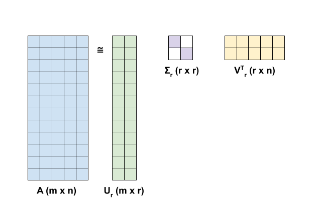

# Guide

这是一个用于测试的子目录 Markdown。

## 目录

- [Section 1](#section-1)
- [Section 2](#section-2)

## Section 1

- 返回 [Demo Home](../README.md)
- 跳转到 [Advanced](./advanced.md)
- 跳到当前文档的 [Section 2](#section-2)

## Section 2

本节用于测试本地图片。

- 返回当前文档的 [Section 1](#section-1)
